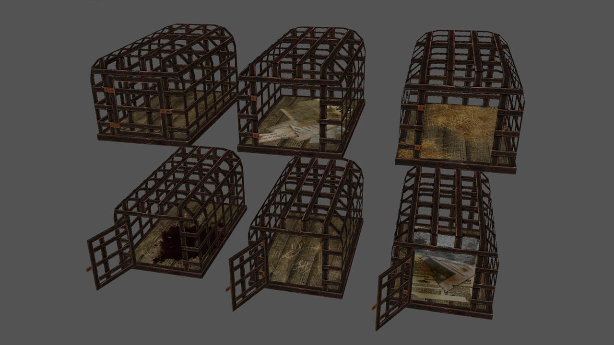

# Rat cage
Rat cage and door with several skin options

## Details
File locations can be changed in the .skin and .mtr files, but to use the defaults:
- place .lwo files into `models/darkmod/custom`
- place .tga files into `textures/darkmod/custom`
- place .dds files into `dds/textures/darkmod/custom`
- place .mtr file into `materials`
- place .skin file into `skins`

## Credits
Author: Kerry000

## 3D preview
[link](rat_cage_preview.stl)

## Preview image
