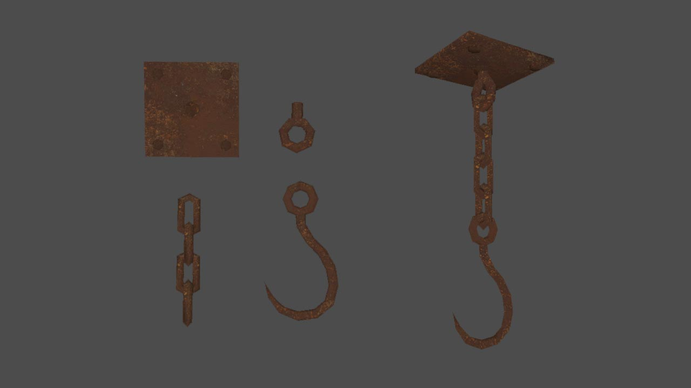

# Meat Hook

## Details
- comes in separate pieces to allow the mapper to make different chain lengths, and rotate the hook and chain independently of the base plate

## 3D preview
[link](hook_combined.stl)

## Preview image
